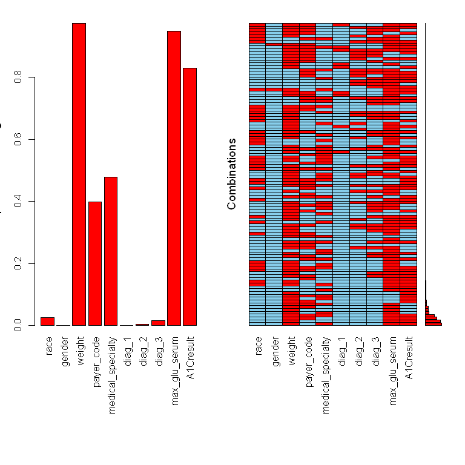

<!-- README.md is generated from README.Rmd. Please edit that file -->

# BIS620.2022.final

**Name: Jingnan Bai**

**NetID: jb3633**

<!-- badges: start -->

[](https://github.com/JingnanBai/BIS.620.2022.final/actions/workflows/R-CMD-check.yaml)
[](https://github.com/JingnanBai/BIS.620.2022.final/actions/workflows/lint.yaml)
[](https://app.codecov.io/gh/JingnanBai/BIS.620.2022.final?branch=master)
<!-- badges: end -->

This repository is for the final project for BIS620 - Yale University
2022Fall

This package contains basic data cleaning and visualization functions,
including: - replace “?” “Unknown” etc. to NA in R - exploring possible
missing pattern (missing as pair for example) - deal with missing data
by dropping and filling - outlier exploration and process - find
extremely imbalanced columns and process - map mark to the true value
(ICD-9, other dataset)

Also, it provides basic function for modeling: - build with WOE coding -
build models for classification, support cross-validation, calculating
the best threshold automatically, and model evaluation. - Logistic
Regression - Random Forest - SMOTE sampling for imbalanced problem

Please refer to [vignette
document](https://github.com/JingnanBai/BIS.620.2022.final/blob/228fc9c408614d10b08edda345720e57edc16872/doc/BIS620_2022_final.html)
for an example that show how this package could be used for finding
possible factors of diabetic patients’ readmission and build a predictor
to estimate the risk.

## Installation

You can install the development version of BIS620.2022.final from
[GitHub](https://github.com/) with:

``` r
# install.packages("devtools")
devtools::install_github("JingnanBai/BIS.620.2022.final")
```

## Example

This is a basic example for data processing and modeling

``` r
library(BIS620.2022.final)
## get data
data("diabetic_data")
```

data cleaning for missing value:

``` r
mark_list <- c("?", "unknown", "invalid", "not available", "not mapped",
              "null", "none")
diabetic_data <- replace_missing_dataset(diabetic_data, mark_list = mark_list)
res <- missing_explore(diabetic_data)
# show the missing pattern
plot(res$pattern_plot, oma = c(12, 3, 2, 2))
```



for WOE coding:

``` r
# WOE transformation
res_woe <- build_woe(diabetic_data, ycol = "readmitted",
                               positive = "YES", is_dropsame = TRUE)
#> ℹ Creating woe binning ...
#> Warning in check_const_cols(dt): There were 4 constant columns removed from input dataset,
#> acetohexamide, examide, citoglipton, glimepiride.pioglitazone
#> ✔ Binning on 66221 rows and 44 columns in 00:00:13
#> ℹ Converting into woe values ...
#> ✔ Woe transformating on 66221 rows and 43 columns in 00:00:02
#> [1] "delete 17 constant columns"
diabetic_data_woe <- res_woe$newdata

# get the mapping information for explanation later.
tab_explain_woe <- get_woe_explain(diabetic_data_woe, diabetic_data)
```

for SMOTE:

``` r
data <- data.frame(y=rep(as.factor(c('Yes', 'No')), times=c(90, 10)), 
                   x1=rnorm(100), x2=rnorm(100))
summary(data$y)
#>  No Yes 
#>  10  90
data_smote <- upsample_smote(data, "y")
summary(data_smote$y)
#>  No Yes 
#>  90  90
```
